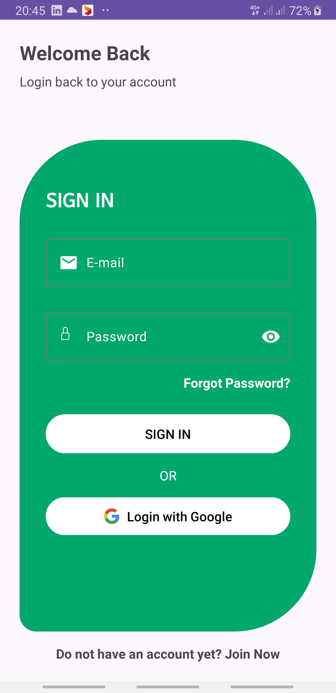
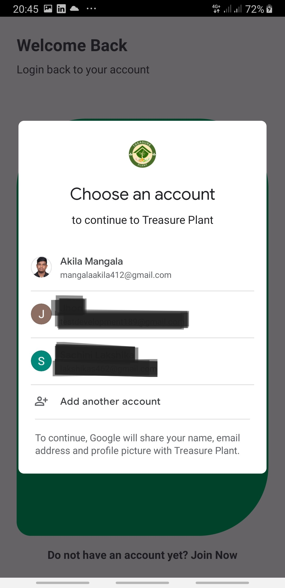
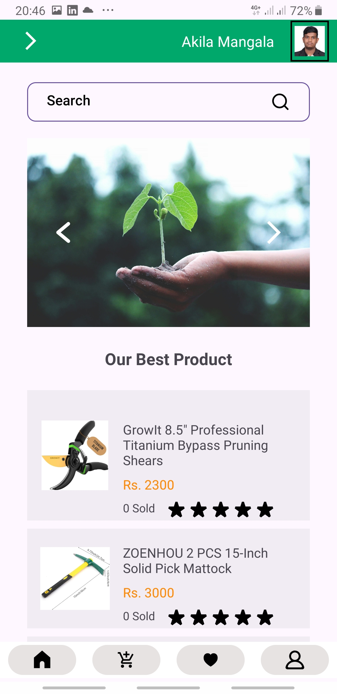
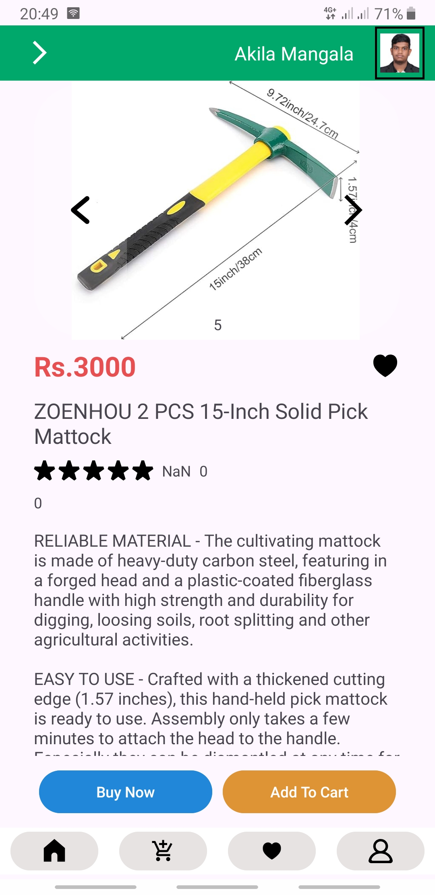
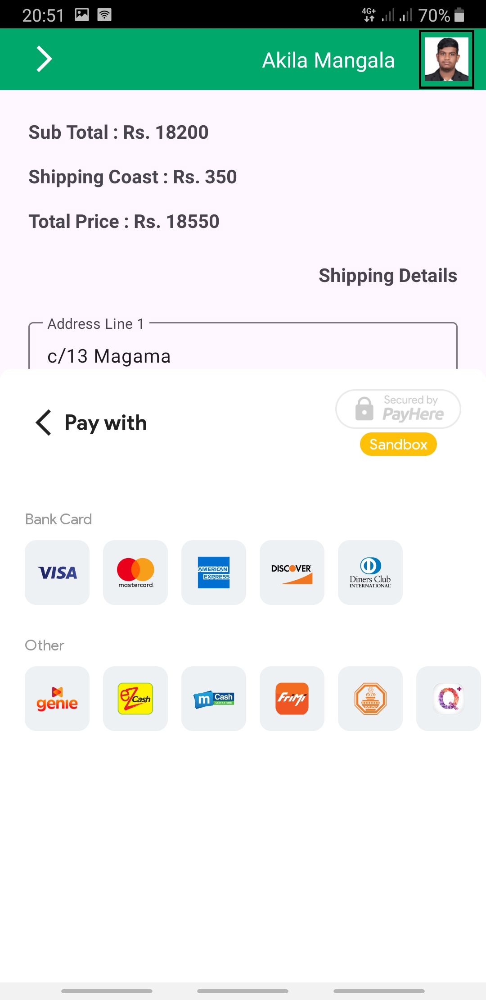

# 📌 Project Overview

Treasure Plant is an Android-based mobile shopping application designed to help farmers purchase agricultural products such as fertilizers, seeds, and tools easily. The app provides a user-friendly interface, secure authentication and a seller dashboard for managing product listings.

# 🚀 Features

### ✅ User Roles:

   Customers – Browse products, add to cart, place orders and view order history.
  
   Sellers – Register as a seller, upload/manage products, and track sales.
  
   Admins – View daily income using bar chart, seller management (block / unblock, view seller location, call directly seller)

### ✅ Key Functionalities:

  Secure Login & Registration (Google Sign-In, Firebase Authentication).
  
  Product Browsing & Search (Category-wise and keyword search).
  
  Shopping Cart & Checkout (PayHere integration for secure payments).
  
  Seller Dashboard (Add products, manage stock, view added products).
  
  Bug Reporting via Sensors (Shake or flip phone to report an issue).

### 🛠️ Technologies Used
  Frontend: Java (Android Studio), XML (UI Design).

Backend: Firebase Firestore (Database), SQLite (Local Storage).

APIs & Services: Google Maps API, PayHere Payment Gateway, Firebase Authentication.

# 📷 Screenshots

### 🔹 Customer Login Screen

### 🔹 Google Authentication

### 🔹 Customer Home Screen

### 🔹 Single Product View Screen

### 🔹 Payhere

